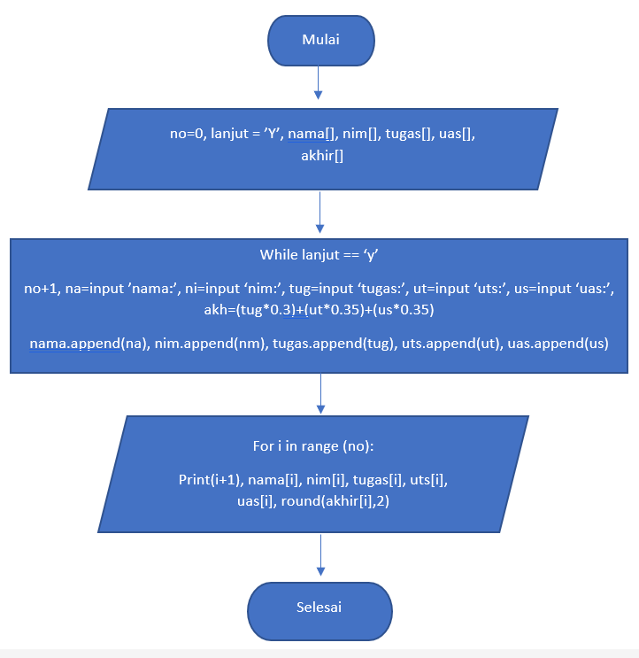
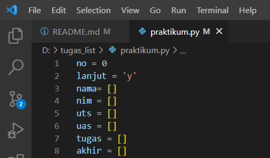
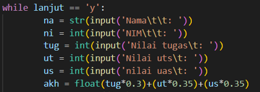
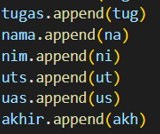
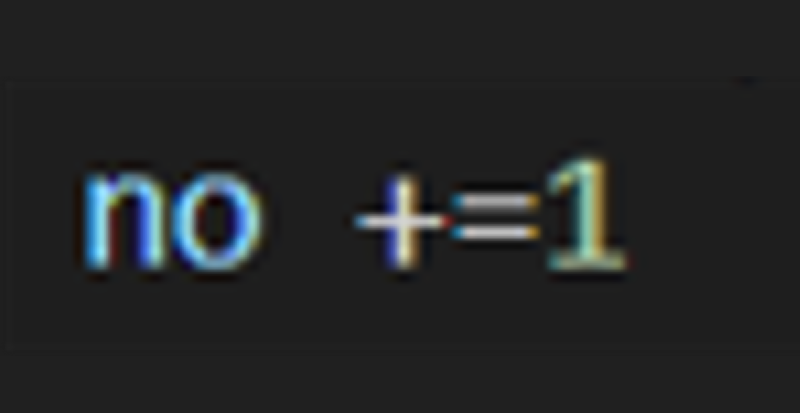
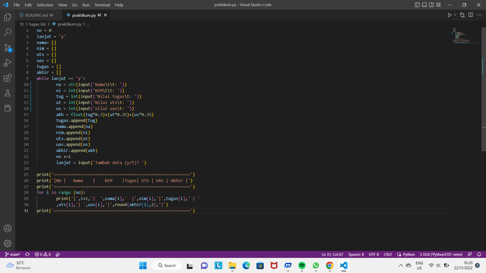
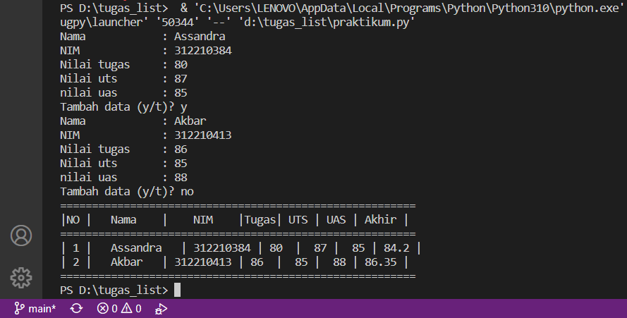

# Program Menambhakan Data Pada List

1. Pertama tama iyalah membuat sebuah variabel list yang terdiri dari beberapa variabel seperti pada gambar di bawah ini.

2. Cara untuk melakukan perubahan data pada variabel yang telah kita bikin ialah dengan menggunakan perulangan while agar kita bisa menambahkan lebih dari satu data dan untuk menambahkan data ialah menggunakan 'y' dan untuk menghentikan list data ialah dengan mengetikan kata yang lain seperti pada gambar di bawah ini.

kode untuk proses perhitungan pada nilai akhir yang di ambil dari tugas 30%, uts 35%, uas 35% , lalu kita gunakan perintah append agar nilai yang kita input kan bisa masuk ke dalam variabel list yang telah kita buat.

kita juga menggunakan operator assigment pada variabel no yang berfungsi sebagai batas pada perulangan for.

terakhir kita input 'lanjut (y/t)'?, fungsi ini adalah untuk melanjut kan perulangan dengan menginputkan 'y' dan untuk memberhentikan inputan ialah dengan menginputkan 't'.

3. Output dari program yang sudah kita buat di sini ialah menggunakan perulangan for
  `for i in range(no) print(nama[i], nim[i], tugas[i], uts[i], uas[i], akhir[i]) 

# CONTOH PROGRAM 

# HASIL PROGRAM
